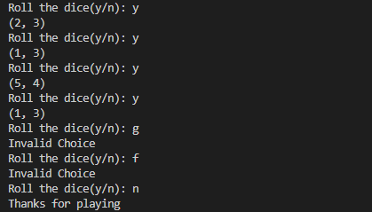

Here's a sample `README.md` for your dice rolling game project:

---

# Dice Rolling Game 🎲

This is a simple Python-based dice rolling game where players roll a die, and the outcome is displayed on the terminal. It includes two main files:

1. `game.py`: The core game logic for rolling the dice and displaying the result.
2. `map.txt`: A guideline (map) explaining what to write in each line of the game code, with comments to make it easier to follow.

## Features
- Roll a 6-sided die with a random outcome.
- Simple and easy-to-understand Python code.
- Step-by-step explanation of the code in the `map.txt` file.
  
## How to Run

1. Clone this repository:

   ```bash
   git clone https://github.com/yourusername/dice-rolling-game.git
   cd dice-rolling-game
   ```

2. Run the game in your terminal:

   ```bash
   python game.py
   ```

3. The game will roll a die and display the result in the terminal.

## Example

Below is an example of what you'll see in the terminal after running the game:




*(You can add a screenshot of your terminal output to the `assets` folder and reference it here.)*

## File Structure

```
dice-rolling-game/
│
├── game.py          # Core game logic
├── map.txt          # Guideline for writing the code
├── README.md        # Project description
└── assets/
     └── terminal-output.png  # Terminal output screenshot (optional)
```

## Code Explanation

The game is structured as follows:

- **game.py**: Contains the logic to simulate a die roll using Python's built-in `random` module. The result is displayed to the user in the terminal.
- **map.txt**: Step-by-step breakdown of the game code with comments on what each section does.

## Future Improvements
- Add a multi-player feature to keep track of scores.
- Allow the user to choose the number of sides on the die.

## Contribution
Feel free to fork this project and contribute! You can submit a pull request if you want to suggest any improvements.

## License
This project is licensed under the MIT License - see the [LICENSE](LICENSE) file for details.

---

To add the terminal screenshot, you can run the game, take a screenshot of the output, and then save it in an `assets` folder in your project. Then reference the image in your `README` using the path like in the example above.

Let me know if you'd like any adjustments!
